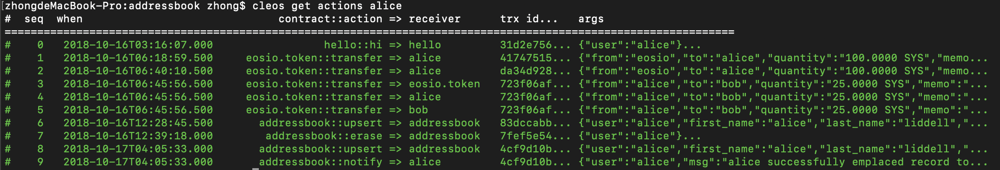

## 2.5 添加Inline Actions

### 介绍

通过先前对`addressbook`合约的授权演示了multi-index tables的基本操作.在本系列教程的这一部分你会学会如何构造一个actions,并从合约中发送这些actions.


### Step 1:将eosio.code添加到权限

为了从`addressbook`发送inline actions,添加`eosio.code`权限到合约的账户的活动权限.打开terminal并执行下面命令:

```bash
cleos set account permission addressbook active '{"threshold": 1,"keys": [{"key": "EOS8QPw89hqrzohK6gKTHG8bVCte3thbwceE7rFN25k8GdPgsBJuu","weight": 1}], "accounts": [{"permission":{"actor":"addressbook","permission":"eosio.code"},"weight":1}]}' -p addressbook@owner
```

`eosio.code`授权是增强安全性的伪授权,并允许合约可以执行inline actions.


### Step2: 通知 Aciton

如果还没打开,打开上一个教程中授权好的`addressbook.cpp`合约.写一个action以处理"transaction receipt".在`addressbook`类中创建一个 *private* helper function来完成它.

```c++
 [[eosio::action]]
  void notify(account_name user, std::string msg) {}
```

该函数非常简单,只接收一个`account_name`和`string`.


### Step 3:使用require_recipient拷贝action到sender

该交易需要被拷贝给user以让其可被视为收据.为了实现该需求,使用[require_recipient](https://developers.eos.io/eosio-cpp/reference#require_recipient) 方法.

```c++
  [[eosio::action]]
  void notify(account_name user, std::string msg) {
   require_recipient(user);
  }
```

这个action非常简单,它会把给到的action拷贝给传入的user.但是,作为写入,任何用户都可以调用该函数以及从该合约做一个"假"的收据.这可能被用在恶意行为上,应该将其视为一个弱点.为了改善它,要求调用此action的权限来自合约,为此,使用  [get_self](https://developers.eos.io/eosio-cpp/v1.3.0/reference#get_self).

```c++
  [[eosio::action]]
  void notify(account_name user, std::string msg) {
    require_auth(get_self());
    require_recipient(user);
  }
```

现在,如果用户`bob`直接调用该函数,但是传入的参数是`alice`,这个action会抛出一个异常.


### Step 4:通知helper发送inline transactions

因为inline action会被多次调用,写一个快捷的helper来让代码可以最大程度复用.在你合约的private区域定义一个新的函数:

```c++
...
	private: 
  	void send_summary(account_name user, std::string message){}
```

在这个helper中构造一个action并发送它.


### Step 5:Action 构造函数

修改`addressbook`合约,让用户每次操作合约action时都发送一个收据给他们.

首先,解决"创建记录"的情况.当在表中找不到记录是触发该情况,当`iterator == addresses.end()`为`true`时.

将该对象存为一个`action` variable命名为`notification`.

```c++
...
  private: 
    void send_summary(account_name user, std::string message){
      action(
        //permission_level,
        //code,
        //action,
        //data
      );   
    }
```

该action构造需要几个参数:

* [permission_level](https://developers.eos.io/eosio-cpp/reference#structeosio_1_1permission__level) struct
* 将要调用的合约(通过宏`N()`转换的)
* 将要调用的action(通过宏`N()`转换的)
* 传给action的数据,一个和将要被调用的actions相关的位置tuple


#### The Permission struct

在该合约中,许可应该通过合约使用`get_self()`的`active`权限来授权.提醒一下,要使用内联的`active`权限,你需要你的合约给`eosio.code`伪权限授权(上面提到过).

```c++
...
  private: 
    void send_summary(account_name user, std::string message){
      action(
        permission_level{get_self(),N(active)},
      );
    }
```


#### The Code,"account where contract is deployed"的别称

因为action将在该合约被调用,使用 [get_self](https://developers.eos.io/eosio-cpp/v1.3.0/reference#get_self) . `N(addressbook)`在现在的情况下也可以, 但如果合约被其他的账户名部署,就不可以了.所以,`get_self()`是最佳选择.

```c++
...
  private: 
    void send_summary(account_name user, std::string message){
      action notification = action(
        permission_level{get_self(),N(active)},
        get_self(),
        //action
        //data
      );
    }
```


#### The Action

先前定义好的`notify`action将被该inline action调用.在这使用宏`N()`.

```C++
...
  private: 
    void send_summary(account_name user, std::string message){
      action(
        permission_level{get_self(),N(active)},
        get_self(),
        N(notify),
        //data
      );
    }
```


#### The Data

最后,把要传给该action的data定义好.通知函数接受两个参数,`account_name`和一个`string`.action构造函数需要`bytes`类型的数据,所以可以使用`make_tuple`,这个函数由C++ `std` library提供.传到tuple中的数据是有位置的,并由被调用的action中接受参数的顺序决定.

* 传入由`upsert()`action提供的`user`变量.
* 连接一个字符串:user的名字,以及传给`notify`action的`message`.

```c++
...
  private: 
    void send_summary(account_name user, std::string message){
      action(
        permission_level{get_self(),N(active)},
        get_self(),
        N(notify),
        std::make_tuple(user, name{user}.to_string() + message)
      );
    }
```


#### 发送action

最后,使用action struct的`send`方法来发送该action.

```c++
...
  private: 
    void send_summary(account_name user, std::string message){
      action(
        permission_level{get_self(),N(active)},
        get_self(),
        N(notify),
        std::make_tuple(user, name{user}.to_string() + message)
      ).send();
    }

```


### Step 6:调用helper并注入相关信息

现在helper已经定义好的,它应该在相关的位置被正确调用.这有三个特定的位置可以让这个新的`notify`helper被调用:

* 当合约`emplaces`了一条新纪录后:

  `send_summary(user, "successfully emplaced record to addressbook");`

* 当合约`modifies`了一条现存记录后:

  `send_summary(user, "successfully modified record in addressbook.");`

* 当合约`erases`了一条现存记录后:

  `send_summary(user, "successfully erased record from addressbook");`


### Step 7:更新EOSIO_ABI宏

新的action`notify`已经加到该合约中了,所以需要在文件底部将`notify` action添加到`EOSIO_ABI`中.这样就能使`eosio.cdt`的优化器不会将其清除了.

```c++
EOSIO_ABI( addressbook, (upsert)(erase)(notify) )
```

现在,准备就绪,这是`addressbook`合约的当前状态:

```c++
#include <eosiolib/eosio.hpp>
#include <eosiolib/print.hpp>

using namespace eosio;

class addressbook : public eosio::contract {

public:
  using contract::contract;

  addressbook(account_name self): contract(self) {}

  [[eosio::action]]
  void upsert(account_name user, std::string first_name, std::string last_name, std::string street, std::string city, std::string state) {
    require_auth( user );
    address_index addresses(_self, _self);
    auto iterator = addresses.find( user );
    if( iterator == addresses.end() )
    {
      addresses.emplace(user, [&]( auto& row ) {
       row.key = user;
       row.first_name = first_name;
       row.last_name = last_name;
       row.street = street;
       row.city = city;
       row.state = state;
      });
      send_summary(user, "successfully emplaced record to addressbook");
    }
    else {
      std::string changes;
      addresses.modify(iterator, user, [&]( auto& row ) {
        row.key = user;
        row.first_name = first_name;
        row.last_name = last_name;
        row.street = street;
        row.city = city;
        row.state = state;
      });
      send_summary(user, "successfully modified record in addressbook.");
    }
  }

  [[eosio::action]]
  void erase(account_name user){
    // require_auth(user);
    address_index addresses(_self, _self);
    auto iterator = addresses.find( user );
    eosio_assert(iterator != addresses.end(), "Record does not exist");
    addresses.erase(iterator);
    send_summary(user, "successfully erased record from addressbook");
  }

  [[eosio::action]]
  void notify(account_name user, std::string msg) {
    require_auth(get_self());
    require_recipient(user);
  }

private:
  struct [[eosio::table]] person {
    account_name key;
    std::string first_name;
    std::string last_name;
    std::string street;
    std::string city;
    std::string state;
    uint64_t primary_key() const { return key; }
  };
  typedef eosio::multi_index<N(people), person> address_index;

  void send_summary(account_name user, std::string message){
    action(
      permission_level{get_self(),N(active)},
      get_self(),
      N(notify),
      std::make_tuple(user, name{user}.to_string() + " " + message)
    ).send();
  }

};

EOSIO_ABI( addressbook, (upsert)(notify)(erase) )
```


### Step 8:重新编译和重新生成ABI文件

打开terminal,进入`/Users/zhong/coding/CLion/contracts/addressbook`

```bash
cd /Users/zhong/coding/CLion/contracts/addressbook
```

现在,重新编译合约,添加`--abigen`标记因为对合约的修改会影响到ABI.如果你细心的跟着说明操作,你应该不会看到错误.

```bash
eosio-cpp -o addressbook.wasm addressbook.cpp --abigen
```

EOSIO上的合约是可以升级的,因此合约改变后能重新部署.

Result:

```bash
Reading WASM from /Users/zhong/coding/CLion/contracts/addressbook/addressbook.wasm...
Publishing contract...
executed transaction: 0b920b0b9f70ccd3599f479860fc1f9e28fe2e6254660b3134ac0f1dbdb10f50  7288 bytes  1004 us
#         eosio <= eosio::setcode               {"account":"addressbook","vmtype":0,"vmversion":0,"code":"0061736d0100000001a5011a60027f7e0060037f7e...
#         eosio <= eosio::setabi                {"account":"addressbook","abi":"0e656f73696f3a3a6162692f312e30000405657261736500010475736572046e616d...
warning: transaction executed locally, but may not be confirmed by the network yet    ] 
```

成功!


### Step 9:测试

现在合约已经修改并部署好,开始测试它.在先前的教程中,alice的addressbook记录在测试的时候删除了,所以调用`upsert`可以触发刚刚写到"create"分支的inline action.

```bash
cleos push action addressbook upsert '["alice", "alice", "liddell", "123 drink me way", "wonderland", "amsterdam"]' -p alice@active
```

`cleos`会返回一些数据,包括这次交易的所有action

```bash
executed transaction: 4cf9d10b3bc0566e659f6d01006f19bcd8b14e4777c428c69dd3baa9e9fedc7f  152 bytes  12699 us
#   addressbook <= addressbook::upsert          {"user":"alice","first_name":"alice","last_name":"liddell","street":"123 drink me way","city":"wonde...
#   addressbook <= addressbook::notify          {"user":"alice","msg":"alice successfully emplaced record to addressbook"}
#         alice <= addressbook::notify          {"user":"alice","msg":"alice successfully emplaced record to addressbook"}
warning: transaction executed locally, but may not be confirmed by the network yet    ] 
```

你能在响应中看到`addressboo::notify`拷贝了本次交易中`alice`的一些信息.使用[cleos get actions](https://developers.eos.io/eosio-cleos/reference#cleos-get-transactions) 来获得与alice相关的执行过的actions.

```bash
cleos get actions alice
```

Result:




